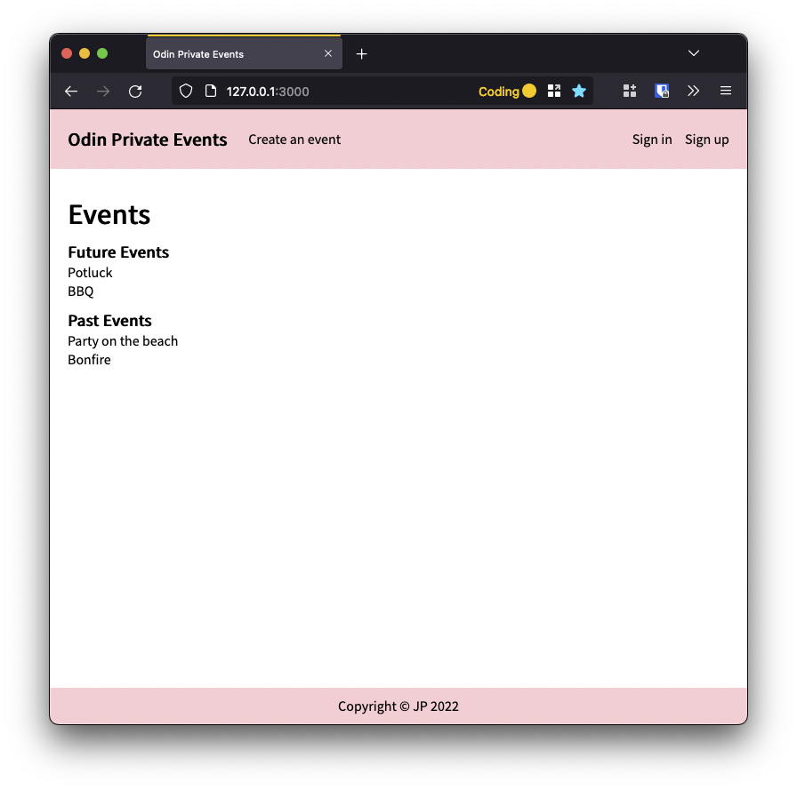

# Odin Private Events

Built as part of [The Odin Project's Full Stack Ruby on Rails](https://www.theodinproject.com/paths/full-stack-ruby-on-rails?) curriculum: [Project: Private Events](https://www.theodinproject.com/lessons/ruby-on-rails-private-events) lesson.

In this app users can create events and sign up to attend events created by other users.

Only registered users can create or attend events but event information is visible to all.

Index Page | Event Page
:-------------------------:|:-------------------------:
 | 

New Event Page | User Page
:-------------------------:|:-------------------------:
 | 

## Techniques Implemented
* Working with User, Event, EventAttendance models using `many_to_many` relationships
* HTML form for event information, including date and time
* Devise gem for user authentication
* Tweaks to Devise to [work with Rails 7 and Turbo Drive](https://github.com/heartcombo/devise/wiki/Troubleshooting-Rails-7-and-Turbo-Drive)
* Styling using CSS and Flexbox
* Styling inspired by [Tailwinds color theme 'Rose'](https://tailwindcss.com/docs/customizing-colors)